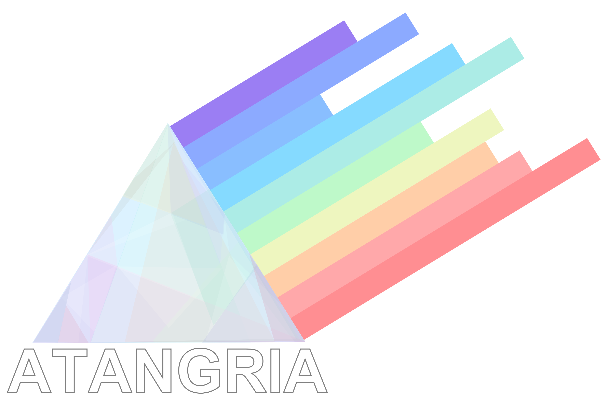

  

# Atangria (SP 8627)
Atangria is a library primarily written for graphics applications. It is a fork from many other famous libraries, 
e.g. SFML and GLFW, with the exception that Atangria was written against OpenGL +3.0.
